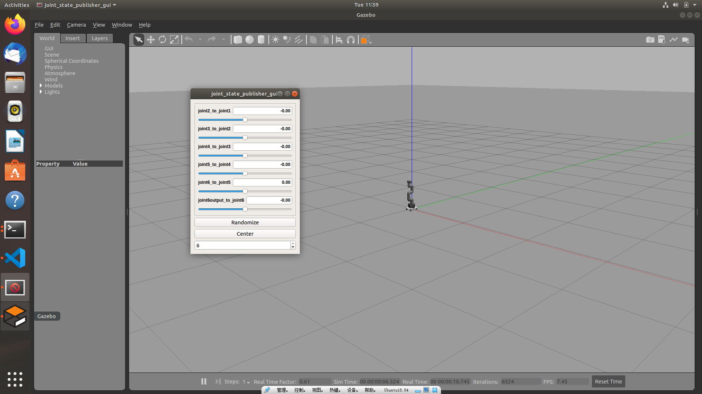

# mycobot_ros
<!-- ALL-CONTRIBUTORS-BADGE:START - Do not remove or modify this section -->
[](#contributors-)
<!-- ALL-CONTRIBUTORS-BADGE:END -->

[](https://docs.elephantrobotics.com/docs/gitbook/12-ApplicationBaseROS/)
[](https://docs.elephantrobotics.com/docs/gitbook-en/12-ApplicationBaseROS/)

[中文文档](https://docs.elephantrobotics.com/docs/gitbook/12-ApplicationBaseROS/) | [English Documentation](https://docs.elephantrobotics.com/docs/gitbook-en/12-ApplicationBaseROS/)

Control or simulate myCobot series robots in ROS.


**Notes**:

* Make sure that `Atom` is flashed into the top Atom and `Transponder` or `minirobot` is flashed into the base Basic .The tool download address: [https://github.com/elephantrobotics/myCobot/tree/main/Software](https://github.com/elephantrobotics/myCobot/tree/main/Software)
* Supported ROS versions:
   * Ubuntu 16.04 / ROS Kinetic
   * Ubuntu 18.04 / ROS Melodic
   * Ubuntu 20.04 / ROS Noetic

<!-- **If your `Atom` is 2.3 or before, or `pymycobot` is 1.\*, Please check branch [before](https://github.com/elephantrobotics/myCobotRos/tree/before)** -->

## Installation
### Option 1: Docker
There are two ways to run this project. The first is by running the project in a container, and this requires
[installing docker](https://docs.docker.com/engine/install/ubuntu/) and
[installing docker-compose](https://docs.docker.com/compose/install/). The benefit of running in the container is that you can run the project in any version of linux, as long as your kernel
is new enough.

Once docker is installed, run the following command, and the project should show up.

#### Without NVIDIA GPU:

**ROS Noetic**:

```
docker-compose build ros-noetic && xhost +local:root && docker-compose up ros-noetic
```

**ROS Melodic**:

```
docker-compose build ros && xhost +local:root && docker-compose up ros
```

#### With NVIDIA GPU

**ROS Noetic**:

```
docker-compose build nvidia-ros-noetic && xhost +local:root && docker-compose up nvidia-ros-noetic
```

**ROS Melodic**:

```
docker-compose build nvidia-ros && xhost +local:root && docker-compose up nvidia-ros
```

This command does three things:
1) `docker-compose build ros`

   This builds the project in a container. That means nothing is installed on your host machine!
   The first time this runs, this command will take a long while. After running it once, caching
   will allow this command to run quickly.

2) `xhost +local:root`

   This command gives X the ability to display GUI's from within the docker container

3) `docker-compose up ros`

   This runs the image specified in the `docker-compose.yml`, which by default runs
   the command `roslaunch mycobot_320 mycobot_320_slider.launch` within the container.

To run other tutorials, set the LAUNCH_TARGET environment variable. For example, to the run the MoveIt tutorial run:

```
export LAUNCH_TARGET=mycobot_320_moveit mycobot320_moveit.launch
docker-compose up ros
```

### Option 2: Local
#### 2.1 Pre-Requriements

For using this package, the [Python api](https://github.com/elephantrobotics/pymycobot.git) library should be installed first.

```bash
pip install pymycobot --user
```

#### 2.2 Package Download and Install

Install ros package in your src folder of your Catkin workspace.

```bash
$ cd ~/catkin_ws/src
$ git clone --depth 1 https://github.com/elephantrobotics/mycobot_ros.git
$ cd ~/catkin_ws
$ catkin_make
$ source ~/catkin_ws/devel/setup.bash
$ sudo echo 'source ~/catkin_ws/devel/setup.bash' >> ~/.bashrc
```

#### 2.3 Test Python API

```bash
cd ~/catkin_ws/src/mycobot_ros
python test.py
```

## Where to get help

There is documentation in the [ElephantRobotics Docs](https://docs.elephantrobotics.com/docs/gitbook-en/). Please check the ROS chapter.

## Important Links & Docs

* [User Guide](https://docs.elephantrobotics.com/docs/gitbook-en/12-ApplicationBaseROS/)

## Contributing

Contributions are always welcome!

See [CONTRIBUTING.md](CONTRIBUTING.md) for ways to get started.

Please adhere to this project's [code of conduct](CODE_OF_CONDUCT.md).

## Screenshots


# MyCobot_280_m5-Gazebo使用说明

## 1. 滑块控制

现已实现通过joint_state_publisher_gui的滑块控制机械臂模型在Gazebo中的位姿，并可通过滑块同时操控Gazebo中机械臂模型与真实的机械臂的位姿。

确认将真实的机械臂连接到电脑以后，查看机械臂连接的端口：

```bash
ls /dev/tty*
```

得到如下的输出结果：

```bash
/dev/tty    /dev/tty26  /dev/tty44  /dev/tty62      /dev/ttyS20
/dev/tty0   /dev/tty27  /dev/tty45  /dev/tty63      /dev/ttyS21
/dev/tty1   /dev/tty28  /dev/tty46  /dev/tty7       /dev/ttyS22
/dev/tty10  /dev/tty29  /dev/tty47  /dev/tty8       /dev/ttyS23
/dev/tty11  /dev/tty3   /dev/tty48  /dev/tty9       /dev/ttyS24
/dev/tty12  /dev/tty30  /dev/tty49  /dev/ttyACM0    /dev/ttyS25
/dev/tty13  /dev/tty31  /dev/tty5   /dev/ttyprintk  /dev/ttyS26
/dev/tty14  /dev/tty32  /dev/tty50  /dev/ttyS0      /dev/ttyS27
/dev/tty15  /dev/tty33  /dev/tty51  /dev/ttyS1      /dev/ttyS28
/dev/tty16  /dev/tty34  /dev/tty52  /dev/ttyS10     /dev/ttyS29
/dev/tty17  /dev/tty35  /dev/tty53  /dev/ttyS11     /dev/ttyS3
/dev/tty18  /dev/tty36  /dev/tty54  /dev/ttyS12     /dev/ttyS30
/dev/tty19  /dev/tty37  /dev/tty55  /dev/ttyS13     /dev/ttyS31
/dev/tty2   /dev/tty38  /dev/tty56  /dev/ttyS14     /dev/ttyS4
/dev/tty20  /dev/tty39  /dev/tty57  /dev/ttyS15     /dev/ttyS5
/dev/tty21  /dev/tty4   /dev/tty58  /dev/ttyS16     /dev/ttyS6
/dev/tty22  /dev/tty40  /dev/tty59  /dev/ttyS17     /dev/ttyS7
/dev/tty23  /dev/tty41  /dev/tty6   /dev/ttyS18     /dev/ttyS8
/dev/tty24  /dev/tty42  /dev/tty60  /dev/ttyS19     /dev/ttyS9
/dev/tty25  /dev/tty43  /dev/tty61  /dev/ttyS2
```

可以看到目前连接的端口是/dev/ttyACM0, 也有可能是/dev/ttyACM1或者是/dev/ttyUSB0等，这将会影响到后续终端输入的端口值。

确认好端口后，打开一个终端输入以下命令，注意port改成上一步查询到的值

```bash
roslaunch mycobot_280_gazebo_moveit follower.launch port:=/dev/ttyACM0 baud:=115200
```

你将会看到如下的界面：



接着打开另外一个终端，输入如下命令：

```bash
rosrun mycobot_280_gazebo_moveit slider_control_gazebo.py _port:=/dev/ttyACM0 _baud:=115200
```

同样记得把端口号修改成上一步查询到的端口号。如果运行成功将会看到如下的终端提示：

```bash
('/dev/ttyACM0', 115200)
spin ...
```

此时便可通过操控joint_state_publisher_gui的滑块来同时操控Gazebo中机械臂模型和真实机械臂的位姿了。

## 2. Gazebo模型跟随

通过如下的命令可以实现Gazebo中的模型跟随实际机械臂的运动而发生位姿的改变，首先运行launch文件：

```bash
roslaunch mycobot_280_gazebo_moveit mycobot_follow_gazebo.launch
```

如果程序运行成功，Gazebo界面将成功加载机械臂模型，机械臂模型的所有关节都处于原始位姿，即[0,0,0,0,0,0]. 此后我们打开第二个终端并运行：

```bash
rosrun mycobot_280_gazebo_moveit follow_display_gazebo.py _port:=/dev/ttyACM0 _baud:=115200
```

现在当我们操控实际机械臂的位姿，我们可以看到Gazebo中的机械臂也会跟着一起运动到相同的位姿。

## 3. 键盘控制

我们还可以使用键盘输入的方式同时操控Gazebo中机械臂模型与实际机械臂的位姿，首先打开一个终端并输入：

```bash
roslaunch mycobot_280_gazebo_moveit teleop_keyboard_gazebo.launch port:=/dev/ttyACM0 baud:=115200
```

同上一部分相同，我们会看到机械臂模型被加载到Gazebo中，并且所有关节都在初始的位姿上，紧接着我们打开另外一个终端并输入：

```bash
rosrun mycobot_280_gazebo_moveit teleop_keyboard_gazebo.py _port:=/dev/ttyACM0 _baud:=115200
```

如果运行成功，我们将在终端看到如下的输出信息：

```shell
Mycobot_280_m5 Teleop Keyboard Controller
---------------------------
Movimg options (control the angle of each joint):
    w: joint2_to_joint1++   s: joint2_to_joint1--
    e: joint3_to_joint2++   d: joint3_to_joint2--
    r: joint4_to_joint3++   f: joint4_to_joint3--
    t: joint5_to_joint4++   g: joint5_to_joint4--
    y: joint6_to_joint5++   h: joint6_to_joint5--
    u: joint6output_to_joint6++ j: joint6output_to_joint6--

Other:
    1 - Go to init pose
    2 - Go to home pose
    3 - Resave home pose
    q - Quit
```

根据上面的提示我们可以知道如何操控机械臂运动了，这里我设置每点击一下机械臂与Gazebo中的机械臂模型会运动1角度，这个运动是不明显的，可以尝试长按上述键位中的其中一个键来到达某一位姿。


## Contributors

Thanks goes to these people ([Emoji Key](https://allcontributors.org/docs/en/emoji-key)):
<!-- ALL-CONTRIBUTORS-LIST:START - Do not remove or modify this section -->
<!-- prettier-ignore-start -->
<!-- markdownlint-disable -->
<table>
  <tbody>
    <tr>
      <td align="center" valign="top" width="14.28%"><a href="https://www.youtube.com/user/Apockill"><br /><sub><b>Alex Thiele</b></sub></a><br /><a href="https://github.com/elephantrobotics/mycobot_ros/commits?author=apockill" title="Code">💻</a></td>
      <td align="center" valign="top" width="14.28%"><a href="https://github.com/nisshan-x"><br /><sub><b>Shinya Nishimoto</b></sub></a><br /><a href="https://github.com/elephantrobotics/mycobot_ros/commits?author=nisshan-x" title="Code">💻</a> <a href="https://github.com/elephantrobotics/mycobot_ros/commits?author=nisshan-x" title="Documentation">📖</a></td>
      <td align="center" valign="top" width="14.28%"><a href="https://www.smilerobotics.com"><br /><sub><b>Takashi Ogura</b></sub></a><br /><a href="https://github.com/elephantrobotics/mycobot_ros/commits?author=OTL" title="Code">💻</a></td>
      <td align="center" valign="top" width="14.28%"><a href="https://github.com/toyoshi"><br /><sub><b>Ryuichiro Toyoshi</b></sub></a><br /><a href="https://github.com/elephantrobotics/mycobot_ros/commits?author=toyoshi" title="Documentation">📖</a></td>
      <td align="center" valign="top" width="14.28%"><a href="https://ry0.github.io/"><br /><sub><b>Ryo Kabutan</b></sub></a><br /><a href="#design-Ry0" title="Design">🎨</a></td>
      <td align="center" valign="top" width="14.28%"><a href="https://github.com/dieu-detruit"><br /><sub><b>Takafumi Watanabe</b></sub></a><br /><a href="https://github.com/elephantrobotics/mycobot_ros/commits?author=dieu-detruit" title="Code">💻</a> <a href="https://github.com/elephantrobotics/mycobot_ros/commits?author=dieu-detruit" title="Documentation">📖</a></td>
      <td align="center" valign="top" width="14.28%"><a href="https://github.com/graziegrazie"><br /><sub><b>Yoshiaki Watanabe</b></sub></a><br /><a href="https://github.com/elephantrobotics/mycobot_ros/commits?author=graziegrazie" title="Code">💻</a></td>
    </tr>
    <tr>
      <td align="center" valign="top" width="14.28%"><a href="https://github.com/mertcookimg"><br /><sub><b>Masato Kobayashi</b></sub></a><br /><a href="https://github.com/elephantrobotics/mycobot_ros/commits?author=mertcookimg" title="Code">💻</a></td>
      <td align="center" valign="top" width="14.28%"><a href="https://profile.tiryoh.com"><br /><sub><b>Daisuke Sato</b></sub></a><br /><a href="https://github.com/elephantrobotics/mycobot_ros/commits?author=Tiryoh" title="Documentation">📖</a> <a href="https://github.com/elephantrobotics/mycobot_ros/commits?author=Tiryoh" title="Code">💻</a></td>
      <td align="center" valign="top" width="14.28%"><a href="https://www.eacousineau.com/"><br /><sub><b>Eric Cousineau</b></sub></a><br /><a href="https://github.com/elephantrobotics/mycobot_ros/commits?author=eacousineau" title="Code">💻</a></td>
      <td align="center" valign="top" width="14.28%"><a href="https://github.com/thandal"><br /><sub><b>thandal</b></sub></a><br /><a href="https://github.com/elephantrobotics/mycobot_ros/commits?author=thandal" title="Code">💻</a></td>
      <td align="center" valign="top" width="14.28%"><a href="https://github.com/nakano16180"><br /><sub><b>nakano16180</b></sub></a><br /><a href="https://github.com/elephantrobotics/mycobot_ros/commits?author=nakano16180" title="Documentation">📖</a></td>
      <td align="center" valign="top" width="14.28%"><a href="https://twitter.com/comocc"><br /><sub><b>Akihiro Komori</b></sub></a><br /><a href="https://github.com/elephantrobotics/mycobot_ros/commits?author=comoc" title="Code">💻</a></td>
      <td align="center" valign="top" width="14.28%"><a href="https://github.com/mostlyjason"><br /><sub><b>Jason Skowronski</b></sub></a><br /><a href="https://github.com/elephantrobotics/mycobot_ros/commits?author=mostlyjason" title="Code">💻</a></td>
    </tr>
    <tr>
      <td align="center" valign="top" width="14.28%"><a href="https://github.com/2929ss"><br /><sub><b>2929ss</b></sub></a><br /><a href="https://github.com/elephantrobotics/mycobot_ros/commits?author=2929ss" title="Code">💻</a></td>
      <td align="center" valign="top" width="14.28%"><a href="https://medium.com/@tks/takasu-profile-c50feee078ac"><br /><sub><b>TAKASU Masakazu</b></sub></a><br /><a href="#promotion-takasumasakazu" title="Promotion">📣</a></td>
      <td align="center" valign="top" width="14.28%"><a href="https://scrapbox.io/saitotetsuya/"><br /><sub><b>SAITO, Tetsuya</b></sub></a><br /><a href="#promotion-3110" title="Promotion">📣</a></td>
    </tr>
  </tbody>
</table>

<!-- markdownlint-restore -->
<!-- prettier-ignore-end -->

<!-- ALL-CONTRIBUTORS-LIST:END -->

This project follows the [all-contributors](https://allcontributors.org/)
specification. Contributions of any kind are welcome!

## License

Licensed under standard three-clause BSD license (same as ROS Core), 
Copyright 2020-2023 Elephant Robotics. [Copy of the license](LICENSE).
