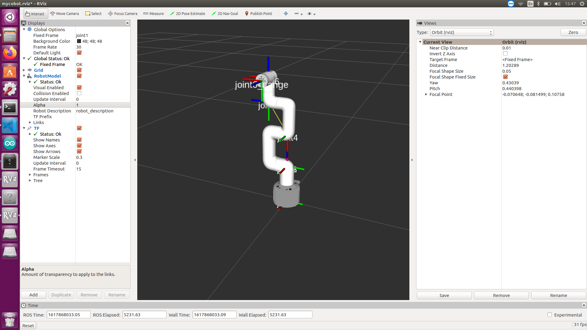
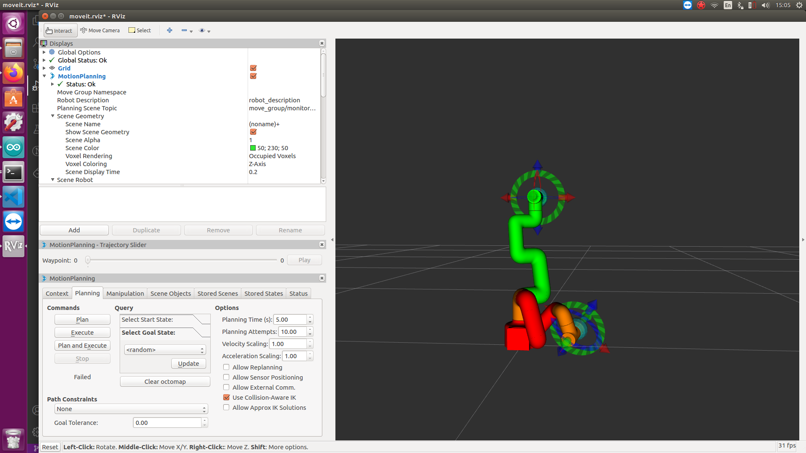

# mycobot_ros

[]()
[]()

[中文文档](https://www.elephantrobotics.com/docs/myCobot/3-development/4-ros&moveit/) | [English Document not finish]()


**Notes**:

<!-- This is the mycobot ROS package designed by Zhang Lijun([lijun.zhang@elephantrobotics.com]()) -->

> Make sure that `Atom` is flashed into the top Atom and `Transponder` is flashed into the base Basic .The tool download address: [https://github.com/elephantrobotics/myCobot/tree/main/Software](https://github.com/elephantrobotics/myCobot/tree/main/Software)<br>
> ubuntu: 16.04LTS<br>
> ros version: 1.12.17

<!-- **If your `Atom` is 2.3 or before, or `pymycobot` is 1.\*, Please check branch [before](https://github.com/elephantrobotics/myCobotRos/tree/before)** -->


## Installation
### Option 1: Docker
There are two ways to run this project. The first is by running the project in a container, and this requires
[installing docker](https://docs.docker.com/engine/install/ubuntu/) and
[installing docker-compose](https://docs.docker.com/compose/install/). The benefit of running in the container is that you can run the project in any version of linux, as long as your kernel
is new enough. 

Once docker is installed, run the following command, and the project should show up:

```
docker-compose build ros && xhost +local:root && docker-compose up ros
```

This command does three things:
1) `docker-compose build ros`
   
   This builds the project in a container. That means nothing is installed on your host machine!
   The first time this runs, this command will take a long while. After running it once, caching 
   will allow this command to run quickly.
   
2) `xhost +local:root`

   This command gives X the ability to display GUI's from within the docker container

3) `docker-compose up ros`

   This runs the image specified in the `docker-compose.yml`, which by default runs
   the command `roslaunch mycobot_ros control_slider.launch` within the container.
   

### Option 2: Local
#### 1.1 Pre-Requriements

For using this package, the [Python api](https://github.com/elephantrobotics/pymycobot.git) library should be installed first.

```bash
pip install pymycobot --user
```

#### 1.2 Package Download and Install

Install ros package in your src folder of your Catkin workspace.

```bash
$ cd ~/catkin_ws/src
$ git clone https://github.com/elephantrobotics/mycobot_ros.git
$ cd ~/catkin_ws
$ catkin_make
$ source ~/catkin_ws/devel/setup.bash
```

#### 1.3 Test Python API

```bash
cd ~/catkin_ws/src/mycobot_ros
python scripts/test.py
```

## Screenshot






## Q & A

**Q: error[101]**

**A:** Make sure that the serial port is not occupied, and that the correct firmware is burned in for atom and basic
