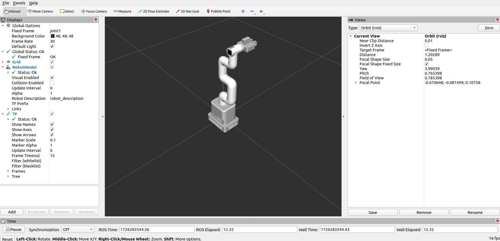
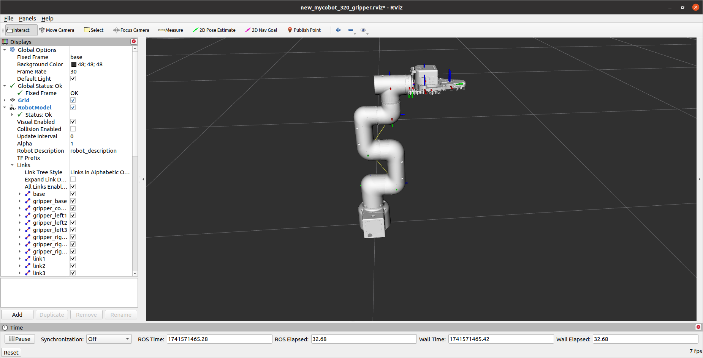
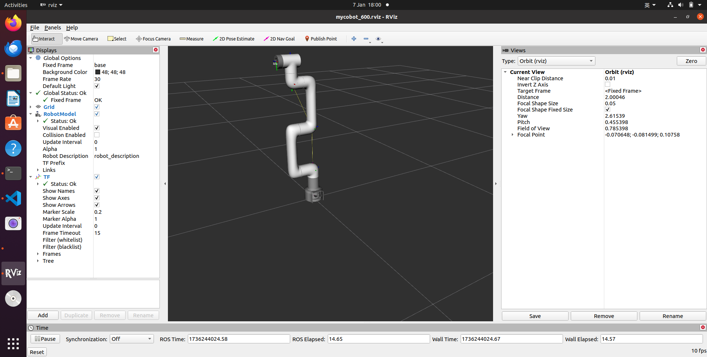

# mycobot_ros
<!-- ALL-CONTRIBUTORS-BADGE:START - Do not remove or modify this section -->
[](#contributors-)
<!-- ALL-CONTRIBUTORS-BADGE:END -->

[](https://docs.elephantrobotics.com/docs/gitbook/12-ApplicationBaseROS/)
[](https://docs.elephantrobotics.com/docs/gitbook-en/12-ApplicationBaseROS/)

[中文文档](https://docs.elephantrobotics.com/docs/gitbook/12-ApplicationBaseROS/) | [English Documentation](https://docs.elephantrobotics.com/docs/gitbook-en/12-ApplicationBaseROS/)

Control or simulate myCobot series robots in ROS.


**Notes**:

* Make sure that `Atom` is flashed into the top Atom and `Transponder` or `minirobot` is flashed into the base Basic .The tool download address: [https://github.com/elephantrobotics/myCobot/tree/main/Software](https://github.com/elephantrobotics/myCobot/tree/main/Software)
* Supported ROS versions:
   * Ubuntu 16.04 / ROS Kinetic
   * Ubuntu 18.04 / ROS Melodic
   * Ubuntu 20.04 / ROS Noetic

* The urdf model of a single gripper in this article is applicable to all machines that support this accessory.
<!-- **If your `Atom` is 2.3 or before, or `pymycobot` is 1.\*, Please check branch [before](https://github.com/elephantrobotics/myCobotRos/tree/before)** -->

## Installation
### Option 1: Docker
There are two ways to run this project. The first is by running the project in a container, and this requires
[installing docker](https://docs.docker.com/engine/install/ubuntu/) and
[installing docker-compose](https://docs.docker.com/compose/install/). The benefit of running in the container is that you can run the project in any version of linux, as long as your kernel
is new enough.

Once docker is installed, run the following command, and the project should show up.

#### Without NVIDIA GPU:

**ROS Noetic**:

```
docker-compose build ros-noetic && xhost +local:root && docker-compose up ros-noetic
```

**ROS Melodic**:

```
docker-compose build ros && xhost +local:root && docker-compose up ros
```

#### With NVIDIA GPU

**ROS Noetic**:

```
docker-compose build nvidia-ros-noetic && xhost +local:root && docker-compose up nvidia-ros-noetic
```

**ROS Melodic**:

```
docker-compose build nvidia-ros && xhost +local:root && docker-compose up nvidia-ros
```

This command does three things:
1) `docker-compose build ros`

   This builds the project in a container. That means nothing is installed on your host machine!
   The first time this runs, this command will take a long while. After running it once, caching
   will allow this command to run quickly.

2) `xhost +local:root`

   This command gives X the ability to display GUI's from within the docker container

3) `docker-compose up ros`

   This runs the image specified in the `docker-compose.yml`, which by default runs
   the command `roslaunch mycobot_320 mycobot_320_slider.launch` within the container.

To run other tutorials, set the LAUNCH_TARGET environment variable. For example, to the run the MoveIt tutorial run:

```
export LAUNCH_TARGET=mycobot_320_moveit mycobot320_moveit.launch
docker-compose up ros
```

### Option 2: Local
#### 2.1 Pre-Requriements

For using this package, the [Python api](https://github.com/elephantrobotics/pymycobot.git) library should be installed first.

```bash
pip install pymycobot --user
```

#### 2.2 Package Download and Install

Install ros package in your src folder of your Catkin workspace.

```bash
$ cd ~/catkin_ws/src
$ git clone --depth 1 https://github.com/elephantrobotics/mycobot_ros.git
$ cd ~/catkin_ws
$ catkin_make
$ source ~/catkin_ws/devel/setup.bash
$ sudo echo 'source ~/catkin_ws/devel/setup.bash' >> ~/.bashrc
```

#### 2.3 Test Python API

```bash
cd ~/catkin_ws/src/mycobot_ros
python test.py
```

## Where to get help

There is documentation in the [ElephantRobotics Docs](https://docs.elephantrobotics.com/docs/gitbook-en/). Please check the ROS chapter.

## Important Links & Docs

* [User Guide](https://docs.elephantrobotics.com/docs/gitbook-en/12-ApplicationBaseROS/)

## Contributing

Contributions are always welcome!

See [CONTRIBUTING.md](CONTRIBUTING.md) for ways to get started.

Please adhere to this project's [code of conduct](CODE_OF_CONDUCT.md).

## Screenshots


## URDF Model Graph

[mycobot 280 m5](./mycobot_description/urdf/mycobot_280_m5/mycobot_280_m5.urdf)


[mycobot 280 m5 gripper](./mycobot_description/urdf/mycobot_280_m5/mycobot_280m5_with_gripper_parallel.urdf)


[mycobot 280 m5 pump](./mycobot_description/urdf/mycobot_280_m5/mycobot_280m5_with_pump.urdf)


[mycobot 280 m5 camera flange](./mycobot_description/urdf/mycobot_280_m5/mycobot_280m5_with_camera_flange.urdf)


[mycobot 280 m5 camera flange & pump](./mycobot_description/urdf/mycobot_280_m5/mycobot_280m5_with_camera_flange_pump.urdf)


[mycobot 280 pi](./mycobot_description/urdf/mycobot_280_pi/mycobot_280_pi.urdf)


[mycobot 280 pi pump](./mycobot_description/urdf/mycobot_280_pi/mycobot_280pi_with_pump.urdf)


[mycobot 280 pi camera flange](./mycobot_description/urdf/mycobot_280_pi/mycobot_280pi_with_camera_flange.urdf)


[mycobot 280 pi camera flange & pump](./mycobot_description/urdf/mycobot_280_pi/mycobot_280pi_with_camera_flange_pump.urdf)


[mycobot 280 JetsonNano](./mycobot_description/urdf/mycobot_280_jn/mycobot_280_jn.urdf)


[mycobot 280 JetsonNano Adaptive gripper](./mycobot_description/urdf/mycobot_280_jn/mycobot_280_jn_adaptive_gripper_parallel.urdf)


[mycobot 280 JetsonNano Parallel gripper](./mycobot_description/urdf/mycobot_280_jn/mycobot_280_jn_parallel_gripper.urdf)



[mycobot 280 Arduino](./mycobot_description/urdf/mycobot_280_arduino/mycobot_280_arduino.urdf)


[mechArm 270 m5](./mycobot_description/urdf/mecharm_270_m5/mecharm_270_m5.urdf)


[mechArm 270 pi](./mycobot_description/urdf/mecharm_270_pi/mecharm_270_pi.urdf)


[myPalletizer 260 m5](./mycobot_description/urdf/mypalletizer_260_m5/mypalletizer_260_m5.urdf)


[myPalletizer 260 pi](./mycobot_description/urdf/mypalletizer_260_pi/mypalletizer_260_pi.urdf)


[mycobot 320 m5 2020](./mycobot_description/urdf/mycobot_320_m5_2020/mycobot_pro_320_m5_2020.urdf)


[mycobot 320 m5 2022](./mycobot_description/urdf/mycobot_320_m5_2022/new_mycobot_pro_320_m5_2022.urdf)


[mycobot 320 m5 2022 gripper](./mycobot_description/urdf/mycobot_320_m5_2022/new_mycobot_pro_320_m5_2022_gripper.urdf)


[mycobot 320 m5 2022 force control gripper](./mycobot_description/urdf/mycobot_320_m5_2022/pro_320_m5_2022_force_gripper.urdf)



[mycobot 320 pi 2022](./mycobot_description/urdf/mycobot_320_pi_2022/new_mycobot_pro_320_pi_2022.urdf)


[mycobot 320 pi 2022 gripper](./mycobot_description/urdf/mycobot_320_pi_2022/new_mycobot_pro_320_pi_2022_gripper.urdf)


[mycobot 320 pi 2022 force control gripper](./mycobot_description/urdf/mycobot_320_pi_2022/pro_320_pi_2022_force_gripper.urdf)


[ultraArm P340](./mycobot_description/urdf/ultraArm_p340/ultraArm_p340.urdf)


[mycobot 280 pi aikit](./mycobot_description/urdf/mycobot_280_pi/mycobot_280pi_with_vision_v2.urdf)


[mycobot 320 pi aikit](./mycobot_description/urdf/mycobot_320_pi_2022/new_mycobot_vision_v2_2022.urdf)


[mybuddy](./mycobot_description/urdf/mybuddy/mybuddy.urdf)


[mycobot pro 600](./mycobot_description/urdf/mycobot_pro_600/mycobot_pro_600.urdf)



[myArm 300 Pi](./mycobot_description/urdf/myarm_300_pi/myarm_300_pi.urdf)


[mycobot pro 630](./mycobot_description/urdf/mycobot_pro_630/mycobot_pro_630.urdf)


## Single Gripper URDF Model Graph

>> **This urdf model is applicable to all machines that support this accessory**

[mycobot Adaptive gripper](./mycobot_description/urdf/adaptive_gripper/mycobot_adaptive_gripper.urdf)


[mycobot Parallel gripper](./mycobot_description/urdf/parallel_gripper/mycobot_parallel_gripper.urdf)


[mycobot Pro Adaptive gripper](./mycobot_description/urdf/pro_adaptive_gripper/mycobot_pro_adaptive_gripper.urdf) - old version


[mycobot Pro Adaptive gripper](./mycobot_description/urdf/pro_adaptive_gripper/new_gripper/mycobot_pro_adaptive_gripper_new.urdf) (new version - Added more details)


## MyCobot_280_m5-Gazebo User Guide
1. Slider Control
The control of the robot arm model's pose in Gazebo through the sliders of joint_state_publisher_gui has now been achieved. Moreover, the pose of the robot arm model in Gazebo and the real robot arm can be controlled simultaneously via the sliders.
After confirming that the real robot arm is connected to the computer, check the port to which the robot arm is connected: 

```bash
ls /dev/tty*
/dev/ttyACM0 or /dev/ttyUSB0
```

The following output results are obtained: 

```bash
/dev/tty    /dev/tty26  /dev/tty44  /dev/tty62      /dev/ttyS20
/dev/tty0   /dev/tty27  /dev/tty45  /dev/tty63      /dev/ttyS21
/dev/tty1   /dev/tty28  /dev/tty46  /dev/tty7       /dev/ttyS22
/dev/tty10  /dev/tty29  /dev/tty47  /dev/tty8       /dev/ttyS23
/dev/tty11  /dev/tty3   /dev/tty48  /dev/tty9       /dev/ttyS24
/dev/tty12  /dev/tty30  /dev/tty49  /dev/ttyACM0   (/dev/ttyUSB0)
/dev/tty13  /dev/tty31  /dev/tty5   /dev/ttyprintk  /dev/ttyS26
/dev/tty14  /dev/tty32  /dev/tty50  /dev/ttyS0      /dev/ttyS27
/dev/tty15  /dev/tty33  /dev/tty51  /dev/ttyS1      /dev/ttyS28
/dev/tty16  /dev/tty34  /dev/tty52  /dev/ttyS10     /dev/ttyS29
/dev/tty17  /dev/tty35  /dev/tty53  /dev/ttyS11     /dev/ttyS3
/dev/tty18  /dev/tty36  /dev/tty54  /dev/ttyS12     /dev/ttyS30
/dev/tty19  /dev/tty37  /dev/tty55  /dev/ttyS13     /dev/ttyS31
/dev/tty2   /dev/tty38  /dev/tty56  /dev/ttyS14     /dev/ttyS4
/dev/tty20  /dev/tty39  /dev/tty57  /dev/ttyS15     /dev/ttyS5
/dev/tty21  /dev/tty4   /dev/tty58  /dev/ttyS16     /dev/ttyS6
/dev/tty22  /dev/tty40  /dev/tty59  /dev/ttyS17     /dev/ttyS7
/dev/tty23  /dev/tty41  /dev/tty6   /dev/ttyS18     /dev/ttyS8
/dev/tty24  /dev/tty42  /dev/tty60  /dev/ttyS19     /dev/ttyS9
/dev/tty25  /dev/tty43  /dev/tty61  /dev/ttyS2
```

Open communication and Chmod

```bash
sudo chmod -R 777 /dev/ttyACM0  or sudo chmod -r 777 /dev/ttyUSB0
sudo chmod -R 777 280m5_gripper_gazebo/280m5_gazebo_gripper/scripts/follow_display_gazebo.py
sudo chmod -R 777 280m5_gripper_gazebo/280m5_gazebo_gripper/scripts/slider_control_gazebo.py
sudo chmod -R 777 280m5_gripper_gazebo/280m5_gazebo_gripper/scripts/teleop_keyboard_gazebo.py
roscore
```

After confirming the port, open a terminal and enter the following command. Note that you should replace "port" with the value you found in the previous step. 

```bash
source devel/setup.bash
roslaunch 280m5_gazebo_gripper slider.launch _port:=/dev/ttyACM0 _baud:=115200
```


Then open another terminal and enter the following command: 

```bash
source devel/setup.bash
rosrun 280m5_gazebo_gripper slider_control_gazebo.py _port:=/dev/ttyACM0 _baud:=115200
```


Also remember to modify the port number to the one queried in the previous step. If the operation is successful, you will see the following terminal prompt: 

```bash
('/dev/ttyACM0', 115200)
spin ...
```


At this point, you can control the poses of both the mechanical arm model in Gazebo or the real mechanical arm simultaneously by manipulating the sliders in the joint_state_publisher_gui. 

2. Gazebo Model Following
The following command can be used to make the model in Gazebo change its pose in accordance with the movement of the actual robotic arm. First, run the launch file: 

```bash
source devel/setup.bash
roslaunch 280m5_gazebo_gripper follower.launch _port:=/dev/ttyACM0
```


If the program runs successfully, the Gazebo interface will successfully load the robotic arm model, and all joints of the robotic arm model will be in the original pose, that is, [0, 0, 0, 0, 0, 0]. After that, we open the second terminal and run: 

```bash
source devel/setup.bash
rosrun 280m5_gazebo_gripper follow_display_gazebo.py _port:=/dev/ttyACM0 _baud:=115200
```


Now when we control the pose of the actual robotic arm, we can see that the robotic arm in Gazebo will also move to the same pose together. 

3. Keyboard Control
We can also use keyboard input to simultaneously control the pose of the robotic arm model in Gazebo and the actual robotic arm. First, open a terminal and enter: 

```bash
source devel/setup.bash
roslaunch 280m5_gazebo_gripper teleop_keyboard.launch _port:=/dev/ttyACM0 _baud:=115200
```


As in the previous part, we will see the robotic arm model loaded into Gazebo, and all joints are at their initial poses. Then we open another terminal and enter: 

```bash
source devel/setup.bash
rosrun 280m5_gazebo_gripper teleop_keyboard_gazebo.py _port:=/dev/ttyACM0 _baud:=115200
```


If the operation is successful, we will see the following output information in the terminal: 

```shell
Mycobot_280_m5_gripper Teleop Keyboard Controller
---------------------------
Movimg options (control the angle of each joint):
w: joint2_to_joint1++   s: joint2_to_joint1--
e: joint3_to_joint2++   d: joint3_to_joint2--
r: joint4_to_joint3++   f: joint4_to_joint3--
t: joint5_to_joint4++   g: joint5_to_joint4--
y: joint6_to_joint5++   h: joint6_to_joint5--
u: joint6output_to_joint6++ j: joint6output_to_joint6--
o:open gripper          p:close gripper
Other:
1 - Go to home pose
q - Quit
```

You can find out which interfaces pymycobot provides in `README.md`.


> Note: Version v3.6.0 differentiates interfaces by model. Starting from this version, the MyCobot class will no longer be maintained. For new usage, please refer to the document: 

   

[MyCobot 280 m5 gazebo中文操作](./mycobot_280/280m5_gazebo_gripper/READMECN.md)

## Contributors

Thanks goes to these people ([Emoji Key](https://allcontributors.org/docs/en/emoji-key)):
<!-- ALL-CONTRIBUTORS-LIST:START - Do not remove or modify this section -->
<!-- prettier-ignore-start -->
<!-- markdownlint-disable -->
<table>
  <tbody>
    <tr>
      <td align="center" valign="top" width="14.28%"><a href="https://www.youtube.com/user/Apockill"><br /><sub><b>Alex Thiele</b></sub></a><br /><a href="https://github.com/elephantrobotics/mycobot_ros/commits?author=apockill" title="Code">💻</a></td>
      <td align="center" valign="top" width="14.28%"><a href="https://github.com/nisshan-x"><br /><sub><b>Shinya Nishimoto</b></sub></a><br /><a href="https://github.com/elephantrobotics/mycobot_ros/commits?author=nisshan-x" title="Code">💻</a> <a href="https://github.com/elephantrobotics/mycobot_ros/commits?author=nisshan-x" title="Documentation">📖</a></td>
      <td align="center" valign="top" width="14.28%"><a href="https://www.smilerobotics.com"><br /><sub><b>Takashi Ogura</b></sub></a><br /><a href="https://github.com/elephantrobotics/mycobot_ros/commits?author=OTL" title="Code">💻</a></td>
      <td align="center" valign="top" width="14.28%"><a href="https://github.com/toyoshi"><br /><sub><b>Ryuichiro Toyoshi</b></sub></a><br /><a href="https://github.com/elephantrobotics/mycobot_ros/commits?author=toyoshi" title="Documentation">📖</a></td>
      <td align="center" valign="top" width="14.28%"><a href="https://ry0.github.io/"><br /><sub><b>Ryo Kabutan</b></sub></a><br /><a href="#design-Ry0" title="Design">🎨</a></td>
      <td align="center" valign="top" width="14.28%"><a href="https://github.com/dieu-detruit"><br /><sub><b>Takafumi Watanabe</b></sub></a><br /><a href="https://github.com/elephantrobotics/mycobot_ros/commits?author=dieu-detruit" title="Code">💻</a> <a href="https://github.com/elephantrobotics/mycobot_ros/commits?author=dieu-detruit" title="Documentation">📖</a></td>
      <td align="center" valign="top" width="14.28%"><a href="https://github.com/graziegrazie"><br /><sub><b>Yoshiaki Watanabe</b></sub></a><br /><a href="https://github.com/elephantrobotics/mycobot_ros/commits?author=graziegrazie" title="Code">💻</a></td>
    </tr>
    <tr>
      <td align="center" valign="top" width="14.28%"><a href="https://github.com/mertcookimg"><br /><sub><b>Masato Kobayashi</b></sub></a><br /><a href="https://github.com/elephantrobotics/mycobot_ros/commits?author=mertcookimg" title="Code">💻</a></td>
      <td align="center" valign="top" width="14.28%"><a href="https://profile.tiryoh.com"><br /><sub><b>Daisuke Sato</b></sub></a><br /><a href="https://github.com/elephantrobotics/mycobot_ros/commits?author=Tiryoh" title="Documentation">📖</a> <a href="https://github.com/elephantrobotics/mycobot_ros/commits?author=Tiryoh" title="Code">💻</a></td>
      <td align="center" valign="top" width="14.28%"><a href="https://www.eacousineau.com/"><br /><sub><b>Eric Cousineau</b></sub></a><br /><a href="https://github.com/elephantrobotics/mycobot_ros/commits?author=eacousineau" title="Code">💻</a></td>
      <td align="center" valign="top" width="14.28%"><a href="https://github.com/thandal"><br /><sub><b>thandal</b></sub></a><br /><a href="https://github.com/elephantrobotics/mycobot_ros/commits?author=thandal" title="Code">💻</a></td>
      <td align="center" valign="top" width="14.28%"><a href="https://github.com/nakano16180"><br /><sub><b>nakano16180</b></sub></a><br /><a href="https://github.com/elephantrobotics/mycobot_ros/commits?author=nakano16180" title="Documentation">📖</a></td>
      <td align="center" valign="top" width="14.28%"><a href="https://twitter.com/comocc"><br /><sub><b>Akihiro Komori</b></sub></a><br /><a href="https://github.com/elephantrobotics/mycobot_ros/commits?author=comoc" title="Code">💻</a></td>
      <td align="center" valign="top" width="14.28%"><a href="https://github.com/mostlyjason"><br /><sub><b>Jason Skowronski</b></sub></a><br /><a href="https://github.com/elephantrobotics/mycobot_ros/commits?author=mostlyjason" title="Code">💻</a></td>
    </tr>
    <tr>
      <td align="center" valign="top" width="14.28%"><a href="https://github.com/2929ss"><br /><sub><b>2929ss</b></sub></a><br /><a href="https://github.com/elephantrobotics/mycobot_ros/commits?author=2929ss" title="Code">💻</a></td>
      <td align="center" valign="top" width="14.28%"><a href="https://medium.com/@tks/takasu-profile-c50feee078ac"><br /><sub><b>TAKASU Masakazu</b></sub></a><br /><a href="#promotion-takasumasakazu" title="Promotion">📣</a></td>
      <td align="center" valign="top" width="14.28%"><a href="https://scrapbox.io/saitotetsuya/"><br /><sub><b>SAITO, Tetsuya</b></sub></a><br /><a href="#promotion-3110" title="Promotion">📣</a></td>
    </tr>
  </tbody>
</table>

<!-- markdownlint-restore -->
<!-- prettier-ignore-end -->

<!-- ALL-CONTRIBUTORS-LIST:END -->

This project follows the [all-contributors](https://allcontributors.org/)
specification. Contributions of any kind are welcome!

## License

Licensed under standard three-clause BSD license (same as ROS Core), 
Copyright 2020-2023 Elephant Robotics. [Copy of the license](LICENSE).
