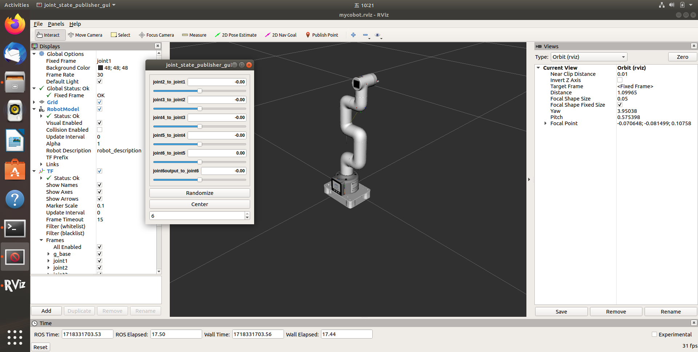
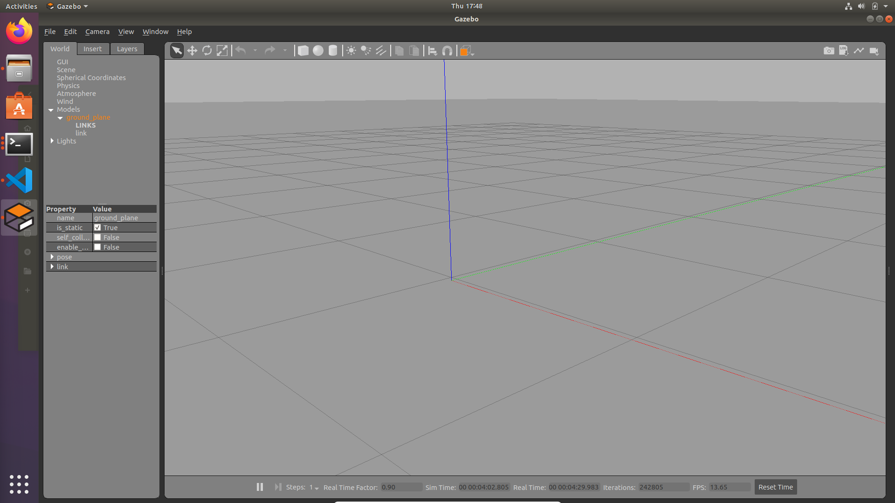
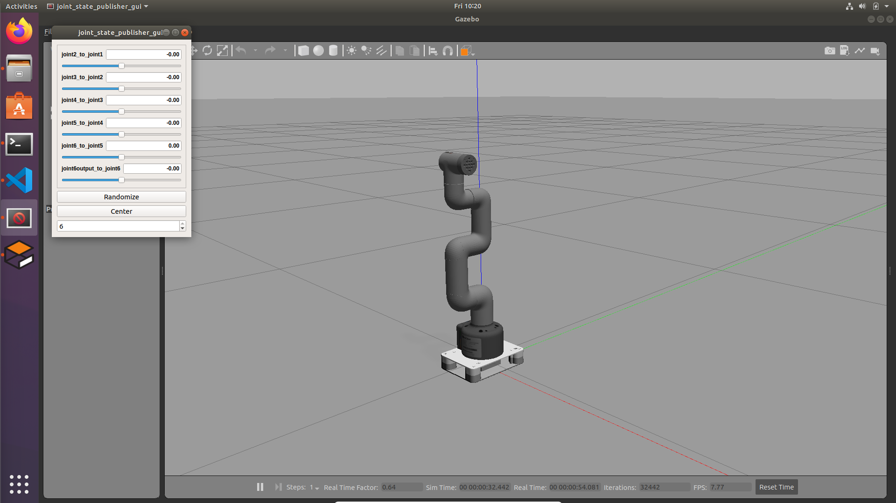

# ROS1 280m5 Gazebo Usage Instruction

## 1. Installation and Configuration

### 1.1 Environment Setup and Configuration

This project is based on Ubuntu18.04 and its corresponding ROS version ROS-melodic, please refer to the [installation guide on the official website of Elephant Robotics](https://docs.elephantrobotics.com/docs/mycobot-m5-en/12-ApplicationBaseROS/12.1-ROS1/12.1.2-EnvironmentBuilding.html) for the installation and configuration.

To confirm that the installation and configuration are correct, enter the following in the terminal command line

```bash
cd ~/catkin_ws
roslaunch mycobot_280 test.launch
```

If you can see the screen as shown below and can manipulate the position of the robot arm model in Rviz by using the sliders, which means that the installation and configuration are all correct.



### 1.2 Installation and Configuration of Gazebo

Before installing the various dependencies of gazebo, please make sure that gazebo can be run and opened properly, open the terminal command line and type in `gazebo`. If everything is fine, Gazebo will load an empty world as follows



You can also check the version of gazebo with the command `gazebo --version`, you will get the output

```bash
Gazebo multi-robot simulator, version 9.0.0
Copyright (C) 2012 Open Source Robotics Foundation.
Released under the Apache 2 License.
http://gazebosim.org


Gazebo multi-robot simulator, version 9.0.0
Copyright (C) 2012 Open Source Robotics Foundation.
Released under the Apache 2 License.
http://gazebosim.org
```

Now that your environment is configured to run Gazebo, you need to install some of Gazebo's ROS dependencies (gazebo_ros_pkgs) by entering

```bash
sudo apt-get install ros-melodic-gazebo-ros-pkgs ros-melodic-gazebo-ros-control
```

This description uses the `melodic` version, if you are using a different version of ROS, replace `melodic` in the command with the corresponding version name.

Immediately after you need to add the setup script source for the .bashrc file, enter the command:

```bash
source /opt/ros/melodic/setup.bash
source ~/catkin_ws/devel/setup.bash
```

## 2. Usage

### 2.1 Slider Control

Press `Ctrl + Alt + T` to open a terminal, go to the path catkin_ws, and build the project by entering `catkin_make`

Then launch Gazebo and the slider control interface

```bash
roslaunch mycobot_280_gazebo_moveit slider_control_gazebo.launch
```

You will see the interface as shown below



Open another terminal, again go to the `catkin_ws` path and enter

```bash
rosrun mycobot_280_gazebo_moveit slider_control_gazebo.py 
```

The terminal will output `spin ...` At this point, the script has begun to listen to the values of the slider and send these values to the robot arm model in Gazebo, at this point, drag the slider, you can see the movement of the robot arm model, so far, the completion of the Moveit slider on the robot arm model control

### 2.2 Model Following

Press `Ctrl + Alt + T` to open a terminal, go to the path catkin_ws, and build the project by entering `catkin_make`

Then start `Gazebo` and load the robot arm model

```bash
roslaunch mycobot_280_gazebo_moveit mycobot_follow_gazebo.launch
```

Gazebo will load the robot arm model, then open another terminal and type

```bash
rosrun mycobot_280_gazebo_moveit follow_display_gazebo.py _port:=/dev/ttyACM0 _baud:=115200
```

Note that the port number here is not necessarily ACM0, it can be queried by the command `'ls /dev/tty*`

**NOTE**: If you are running in a virtual machine, you may not be able to find the corresponding port, this may be because the virtual machine does not have USB turned on, in order to solve this problem, you can first shut down the virtual machine, and then find `USB Device` in the settings, and check the `Enable USB Controller` option, select the `USB 3.0`, and click on the second button on the right side to add the 280m5 robotic arm corresponding to the USB device

There is also the possibility of a `Permission Denied` problem, take the port /dev/ttyACM0 for example, you need to enter the following command line

```bash
sudo chomo 777 /dev/ttyACM0
```

If the port is named something else, just do the substitution. Run it again

```bash
rosrun mycobot_280_gazebo_moveit follow_display_gazebo.py _port:=/dev/ttyACM0 _baud:=115200
```

You can see the Gazebo arm model follows the arm's movement

### 2.3 Keyboard control

You can also use keyboard input to simultaneously manipulate the position of the robotic arm model in Gazebo, first open a terminal and type:

```bash
roslaunch mycobot_280_gazebo_moveit 
```

Same as the previous section, you will see that the robotic arm model is loaded into Gazebo and open another terminal and type:

```bash
rosrun mycobot_280_gazebo_moveit teleop_keyboard_gazebo.py
```

If the program is successfully exectured, you will see the following output in the terminal:

```bash
Mycobot_280_m5 Teleop Keyboard Controller
---------------------------
Movimg options (control the angle of each joint).
    w: joint2_to_joint1++ s: joint2_to_joint1--
    e: joint3_to_joint2++ d: joint3_to_joint2--
    r: joint4_to_joint3++ f: joint4_to_joint3--
    t: joint5_to_joint4++ g: joint5_to_joint4--
    y: joint6_to_joint5++ h: joint6_to_joint5--
    u: joint6output_to_joint6++ j: joint6output_to_joint6--

Other.
    1 - Go to init pose
    2 - Go to home pose
    3 - Resave home pose
    q - Quit
```

According to the above hints we can know how to manipulate the robotic arm movement, here every press on the robotic arm is set to 1 degree and thus the robotic arm model in Gazebo will move 1 angle, this movement is not obvious, you can try to long press one of the above keys to reach a certain position.
