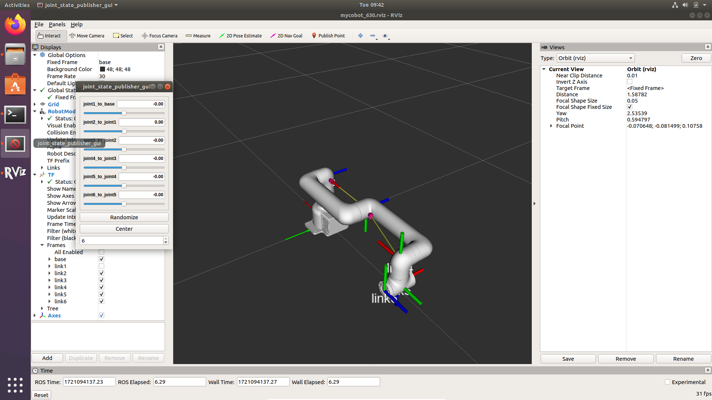

# Pro630 ROS Control Guide Based on Socket Communication

## 1. Installation

### 1.1 Ubuntu and ROS1 Installation and Configuration

First of all, please follow the [Elephant Robotics official website](https://docs.elephantrobotics.com/docs/gitbook-en/12-ApplicationBaseROS/12.1-ROS1/12.1.2-%E7%8E%AF%E5%A2%83%E6%90%AD%E5%BB%BA.html) to complete the installation and configuration of Ubuntu, the installation and configuration of ROS1, and the installation and configuration of MoveIt!

Ubuntu 18.04 is recommended for this project, and the corresponding ROS version is ros-melodic. In order to verify that everything is OK with the above configuration, users can enter the following command in the terminal

```bash
roslaunch mycobot_280 slider_control.launch
```

If the above installations and configurations are proper, the user can see the user interface shown in the following image. By dragging the sliders, you can manipulate the position of each joint of the robot arm



### 1.2 Installation and configuration of the pymycobot library

There are two ways to install the pymycobot libraries, the first is by pip install and the other is by cloning the source code, which will be described in the next section.

#### 1.2.1 `pip install` installation

Open a terminal and enter the command

```bash
pip install pymycobot==3.5.0a3
```

To verify that the installation was successful, you can enter the command line

```bash
pip list | grep pymycobot
```

If it installs properly, the terminal will output `pymycobot` and its corresponding version

#### 1.2.2 `source code` installation

First, go to the path where you want to install the pymycobot library and type in the terminal

```bash
cd /home/<username>/catkin_ws/src/mycobot_ros/mycobot_pro/mycobot_630/scripts
```

Replace `<username>` with the username of the current user, which can be obtained by typing the `who` command on the command line.

Once in that path, install the pymycobot library by cloning the source code

```bash
git clone https://github.com/elephantrobotics/pymycobot.git
```

Go to the cloned folder

```bash
cd /home/<username>/catkin_ws/src/mycobot_ros/mycobot_pro/mycobot_630/scripts/pymycobot
```

Again, you need to replace `<username>` with the current user's username. Once you're in that folder, switch the git branch

```bash
git checkout pro630_esp32
```

If everything is well, the terminal will have the following output

```bash
branch 'pro630_esp32' set up to track 'origin/pro630_esp32'.
Switched to a new branch 'pro630_esp32'
```

Finally, install the library with the following command

```bash
sudo python2 setup.py install
```

## 2. Execution

First open a terminal on your PC and run

```bash
roslaunch mycobot_630 mycobot_630_slider.launch
```

A visualization window for `RViz` and a slider interface for `jont_state_publisher_gui` will pop up.

To ensure that the code on the Raspberry Pi side of the server is working properly, open another terminal on the PC side and run the following commands

**NOTE:** The arm will start in a position parallel to the ground, please make sure that there is **enough** `space` for the arm to move and that the user can press the `emergency stop` button at any time in case of an accident during the use of the arm before you run the following commands!

```bash
rosrun mycobot_630 pro630_slider_control.py
```
